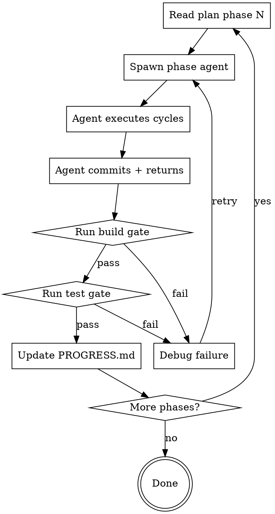

# Execute Plan

**Announce:** "I'm using the execute-plan skill to implement `[plan-file]`."

## Core Principle

One agent per PHASE. Never one agent for the whole plan (context exhaustion). Never one agent per TDD cycle (too much overhead). Phases are the natural unit — 3-5 tightly coupled cycles that share context.

Between every phase: `npm run build` && `npm test`. If either fails, STOP. Don't proceed to next phase with a broken build.

---

## Step 1: Read the Plan

Read the plan file completely. Identify:

1. **Phases** — how many, what cycles each contains
2. **Phase reads** — which files each phase needs (Section 1 of the plan)
3. **Component sub-files** — any `plans/discover-components/` or similar directories with pre-written code
4. **intent.md update points** — which phases need intent.md changes
5. **Branch name** — create the feature branch before Phase 1

```bash
git checkout -b feature/[name-from-plan]
```

---

## Step 2: Execute Phase-by-Phase

For each phase, follow this loop:



### Phase Agent Prompt Template

Spawn each phase agent with this prompt structure:

```
You are implementing Phase {N} of the plan at `{plan-path}`.

BEFORE WRITING ANY CODE:
1. Read `intent.md` — this is the authoritative spec
2. Read ONLY these files for this phase:
   {phase-specific file list from plan Section 1}
3. Read the plan file, but ONLY the Phase {N} section (cycles X through Y)
4. If any component sub-files are referenced (e.g., `plans/discover-components/Foo.svelte`),
   read those and copy them to their target paths as instructed

CODE QUALITY STANDARD (apply to ALL code you write):
- Every exported function gets a JSDoc comment (what, params, returns, side effects)
- Every non-obvious block (regex, math, workarounds) gets a WHY comment
- No magic numbers — use named constants
- No copy-paste — if you're about to duplicate logic, check if it already exists
  in the codebase first (grep for similar function names)
- Variable names must be self-documenting (no single letters except i/j/k loop counters)

EXECUTE each TDD cycle in order:
- RED: Write/copy the test. Run it. Confirm it fails.
- GREEN: Write minimal code to pass. Run test. Confirm green.
- REFACTOR: Clean up per the cycle's refactor step.
- COMMIT after each cycle with the commit message from the plan.

AFTER all cycles in this phase:
- If the plan says to update `intent.md` after this phase, do it now.
- Run: npm run build
- Run: npm test (or the specific test commands from the plan)
- Report what passed/failed.

Branch: {branch-name}
```

### What the Orchestrator Does Between Phases

After each phase agent returns:

1. **Verify the build:**
```bash
npm run build
```
If build fails → DO NOT spawn next phase. Debug first.

2. **Run tests:**
```bash
npm test
```
If tests fail → DO NOT spawn next phase. Debug first.

3. **Code quality review** — spawn a review agent (see Step 2b below).

4. **Check PROGRESS.md** — update it with completed phase + cost so far.

5. **Quick diff review** — `git log --oneline` to verify commits look right.

6. **Report to user:**
```
Phase {N} complete.
- Cycles {X}-{Y}: all committed
- Build: PASS
- Tests: PASS ({count} passing)
- Code quality: PASS / {N} issues fixed
- intent.md: updated / not needed this phase
- Proceeding to Phase {N+1}...
```

### Step 2b: Code Quality Review (between phases)

After build + tests pass, spawn a **review agent** that checks the code written in this phase. This is the junior-dev safety net — catches what tests can't.

**Review agent prompt:**

```
Review the code written in Phase {N}. Run:
  git diff main..HEAD --name-only
to see all files changed. Then read each changed file and check:

1. REDUNDANCY CHECK:
   - Any function that duplicates logic already in the codebase? Search for similar
     function names and patterns. If found, refactor to reuse existing code.
   - Any constants/config values duplicated across files? Extract to shared module.
   - Any copy-pasted blocks within the same file? Extract to helper function.

2. COMMENT QUALITY (junior-dev standard):
   - Every exported function MUST have a JSDoc comment explaining:
     what it does, what params mean, what it returns, and any side effects.
   - Every non-obvious block (regex, math, bitwise, workarounds) MUST have
     an inline comment explaining WHY, not just WHAT.
   - Complex conditionals MUST have a comment explaining the business logic.
   - Magic numbers MUST be named constants with a comment.
   - If a function is >20 lines, it needs a 1-line summary comment at the top.

3. NAMING CHECK:
   - Variable/function names should be self-documenting.
   - No single-letter variables except loop counters (i, j, k).
   - Boolean variables should read as questions: isReady, hasError, canRetry.

FIX any issues found. Commit fixes as "[Phase {N}] code quality cleanup".
Do NOT change behavior — only add comments, extract helpers, rename for clarity.
```

**What this catches that tests don't:**
- Silent duplication (works but wasteful)
- Uncommented complex logic (works but incomprehensible to next dev)
- Poor naming that passes tests but fails readability

---

## Step 3: Handle Failures

### Build Failure

```
Phase {N} build FAILED.

Error: {build error output}

Options:
1. Spawn debug agent to fix (reads build error + phase files)
2. Show me the error and I'll decide
```

Spawn a debug agent with the build error. The debug agent:
- Reads the build error
- Reads only the files modified in Phase N (`git diff --name-only HEAD~{num_commits}..HEAD`)
- Fixes the issue
- Re-runs `npm run build`
- Commits the fix

Then re-run the test gate before proceeding.

### Test Failure

Same pattern but with test output. The debug agent:
- Reads failing test output
- Reads the test file + the implementation file it tests
- Fixes the issue (prefer fixing implementation, not tests — unless the test is wrong)
- Re-runs the specific failing test
- Commits the fix

### Repeated Failure (2+ debug attempts)

Stop and report to user:

```
Phase {N} has failed {X} debug attempts.

What's failing: {summary}
Files involved: {list}

I recommend reviewing before continuing. Want me to:
1. Keep debugging
2. Show you the full error context
3. Roll back Phase {N} and try a different approach
```

---

## Step 4: Completion

After all phases pass:

1. **Final full test run:**
```bash
npm run build && npm test
```

2. **Update PROGRESS.md** — mark all phases complete.

3. **Report:**
```
All {N} phases complete.
- Branch: {branch-name}
- Commits: {count}
- Build: PASS
- Tests: PASS ({count} passing)
- intent.md: updated at phases {X, Y, Z}

Ready for code review or merge.
```

4. **Offer next steps** — code review, merge to main, or PR.

---

## Rules

- **Never skip the build/test gate.** Even if the agent says "everything passed." Verify yourself.
- **Never spawn Phase N+1 while Phase N has failing tests.** Fix first.
- **Always read intent.md fresh at the start of each phase.** It may have been updated by the previous phase.
- **Re-read files modified by earlier phases.** The plan's Section 1 should note this, but double-check — if Phase 3 modifies `evaluator.js` and Phase 4 also touches it, Phase 4 must re-read the current version.
- **Keep agents focused.** Don't give a phase agent the full plan — give it only its phase section + the files it needs.
- **Cost tracking.** Note approximate cost after each phase in PROGRESS.md.
